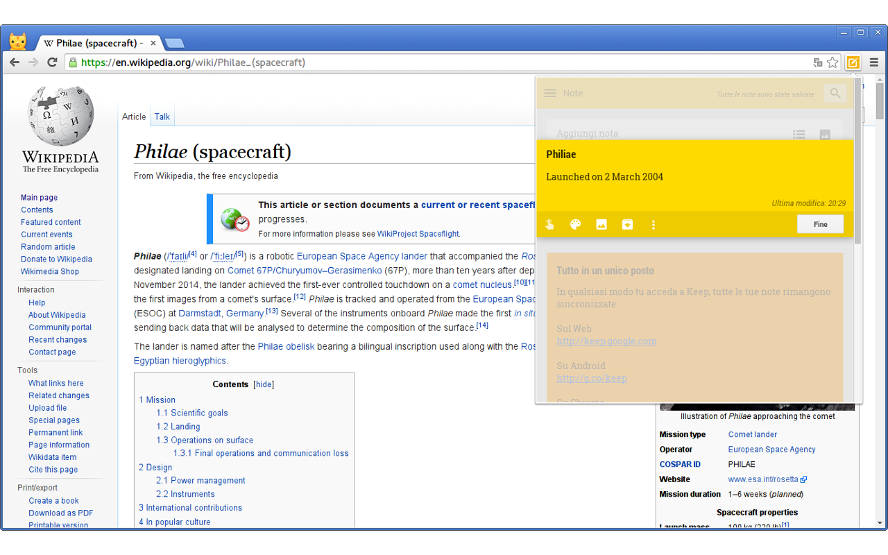
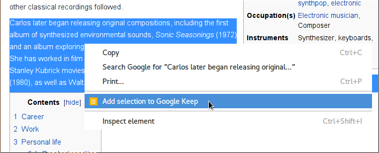
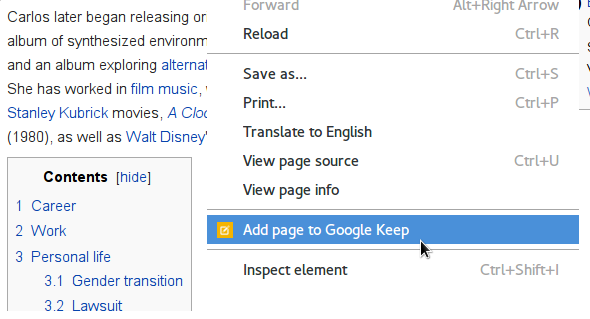
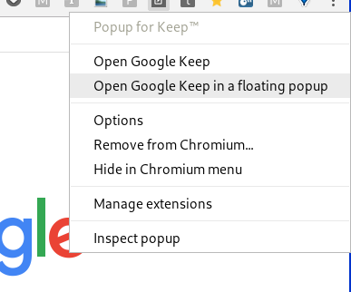
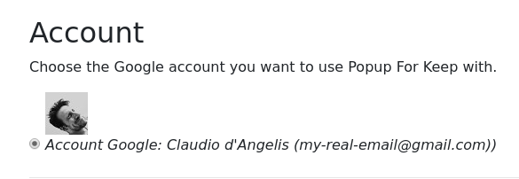

# Popup for Keep™

Load Google Keep™ in a popup from the current tab in Google Chrome™. Install it from [Chrome Web Store](https://chrome.google.com/webstore/detail/popup-for-keep/fhcmhglnohogibbbpbodmjeggpdlboop).

## Features

1. Quickly open Google Keep in a popup on the top-right corner of the Chrome window

2. Create a note with the **selected text** of the current page

3. Create a note with title and URL of the current page

4. Detach the popup from the main window of Chrome and get a little standalone floating window with all your notes

5. Multiple account support

Visit the **Options page** for more features!

# Author(s)

[Claudio d'Angelis](https://claudiodangelis.com) ([@daw985](https://twitter.com/@daw985))

# Support

claudiodangelis@gmail.com

# Credits

This software is distributed under the [Apache License, Version 2.0](https://www.apache.org/licenses/LICENSE-2.0), and it's built on top of:

*   [Angular.io](https://angular.io)
*   [TypeScript](https:typescriptlang.org/)
*   [Bootstrap](https://getbootstrap.com)
